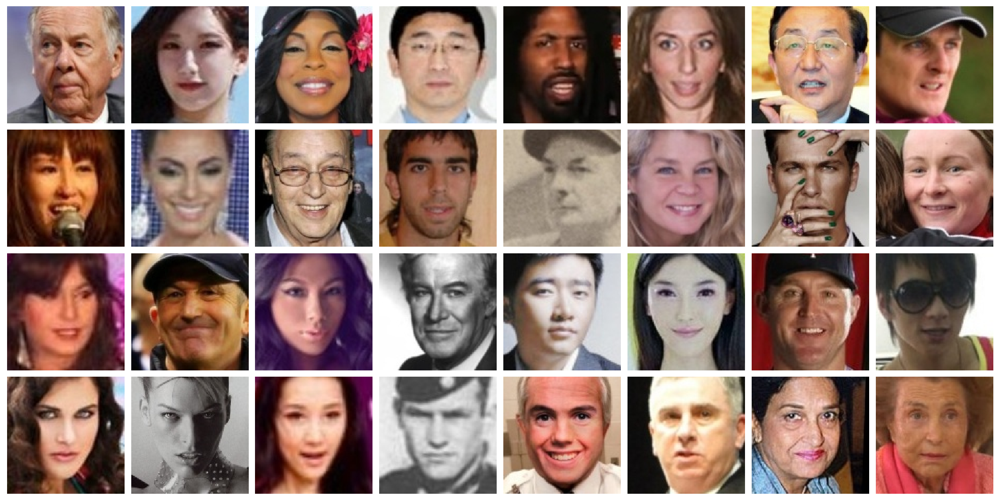

# ArcFace-MXNet-Gluon
ArcFace with MXNet Gluon
## Requirements
+ OpenCV 4.1
+ scikit-image 1.15
+ Dlib 19.17
+ Tensorflow 1.14
+ MXNet 1.5
## Installation
### MMOD Face Detection
```bash
mkdir -p shared/MMOD                    
# Download the dlib face detection model
wget http://dlib.net/files/mmod_human_face_detector.dat.bz2 -P shared/MMOD
# Unpack it
bzip2 -d shared/MMOD/mmod_human_face_detector.dat.bz2
```
### PRNet Landmark Detection
1. Download the pre-trained model shared by the PRNet authors
 at [GoogleDrive](https://drive.google.com/file/d/1UoE-XuW1SDLUjZmJPkIZ1MLxvQFgmTFH/view?usp=sharing)
2. Copy it to **shared/PRNet/net-data**

## Data Preparation
### Training Data
**Deep Glint Dataset**
> http://trillionpairs.deepglint.com/data

+ The Deep Glint dataset is a combination of MS-Celeb-1M-v1c and Asian-Celeb datasets.
It contains around 6.75M images of 180,855 subjects.

  |# Images |# Detected Faces|# IDs  |
  |:-------:|:--------------:|:-----:|
  |6,753,545|    6,749,639   |180,855|
  
+ Download two files **train_msra.tar.gz** (125GB) and **train_celebrity.tar.gz** (91GB)
and unpack both of them to a directory, e.g., **/mnt/Datasets/Glint/images**
+ Pre-processing
  ```bash
  # Create a list of images
  python data/dir2lst.py -i /mnt/Datasets/Glint/images -o /mnt/Datasets/Glint/glint.lst
  # Run MMOD face detection
  python MMOD/face_detector.py -p 8 -d /mnt/Datasets/Glint/images -i /mnt/Datasets/Glint/glint.lst
  # Run PRNet landmark detection
  python PRNet/landmark_detector.py -d /mnt/Datasets/Glint/images -i /mnt/Datasets/Glint/glint_dlib.lst
  # Run face2rec to create a record file for mxnet
  python data/face2rec.py /mnt/Datasets/Glint/glint_dlib_prnet /mnt/Datasets/Glint/images --pack-label --num-thread 8
  ```
+ Visualize the record
  ```bash
  python data/show_record.py --shuffle -i /mnt/Datasets/Glint/glint_dlib_prnet.rec
  ```
  
  <!-- .element height="50%" width="50%" -->
### Testing Data
**LFW**
> http://vis-www.cs.umass.edu/lfw
+ LFW is the most popular face dataset for uncontrolled face verification,
 which contains 13,233 face images of 5,748 subjects collected from the Internet.
 LFW was published in 2007 and has been a standard benchmark in face recognition for a decade.
 The LFW verification protocol provides 6,000 pairs of images split into ten folds.
  
  |# Images|# Detected Faces|# IDs|
  |:------:|:--------------:|:---:|
  | 13,233 |     13,232     |5,748|

+ Download the [lfw.tgz](http://vis-www.cs.umass.edu/lfw/lfw.tgz)
and [pairs.txt](http://vis-www.cs.umass.edu/lfw/pairs.txt) files
and unpack it to a directory, e.g., **/mnt/Datasets/lfw/images**
+ Pre-processing
  ```bash
  # Create a list of images
  python data/dir2lst.py -i /mnt/Datasets/lfw/images -o /mnt/Datasets/lfw/lfw.lst
  # Run MMOD face detection
  python MMOD/face_detector.py -p 8 -d /mnt/Datasets/lfw/images -i /mnt/Datasets/lfw/lfw.lst
  # Run PRNet landmark detection
  python PRNet/landmark_detector.py -d /mnt/Datasets/lfw/images -i /mnt/Datasets/lfw/lfw_dlib.lst
  # Run face2rec to create a record file for mxnet
  python data/face2rec.py /mnt/Datasets/lfw/lfw_dlib_prnet /mnt/Datasets/lfw/images --pack-label --num-thread 8
  # Map the original pairs.txt to new indexes in the list file
  python data/lfw2indices.py -l lfw_dlib_prnet.lst -i /mnt/Datasets/lfw
  ```
+ Visualize the record
  ```bash
  python data/show_record.py --shuffle -i /mnt/Datasets/lfw/lfw_dlib_prnet.rec
  ```
  
  <!-- .element height="50%" width="50%" -->
  
## Training
+ Training ArcFace with Glint dataset using 8 GPUs
  ```bash
  python ArcFace/train.py --gpus 0,1,2,3,4,5,6,7 --num_workers 28 --prefix arcface-glint-nocolor --num_classes 180855
   --train_rec /mnt/Datasets/Glint/glint_dlib_prnet.rec
   --test_rec /mnt/Datasets/lfw/lfw_dlib_prnet.rec
  ```
+ Export trained model (optional)
  ```bash
  python ArcFace/export.py 
   --model shared/ArcFace/arcface-glint-nocolor-best-337551.params
   --output shared/ArcFace/arcface-glint-nocolor
  ```
## Testing
+ Testing ArcFace with LFW dataset
  ```bash
  python ArcFace/test.py --prefix arcface-glint-nocolor
   --model shared/ArcFace/arcface-glint-nocolor-symbol.json
   --test_rec /mnt/Datasets/lfw/lfw_dlib_prnet.rec
  ```
## Pretrained Models
+ [Arcface-Glint](https://www.dropbox.com/s/7sx6ntpkuadufpm/ArcFace-Glint.zip?dl=0)

  | Test set | Accuracy |
  |:--------:|:--------:|
  | LFW |  99.85 ± 0.22 |
  
## Licence
+ Our code is released under MIT License.
## Credits
Many parts of our code is copied from:
+ [PRNet](https://github.com/YadiraF/PRNet)
+ [InsightFace](https://github.com/deepinsight/insightface)